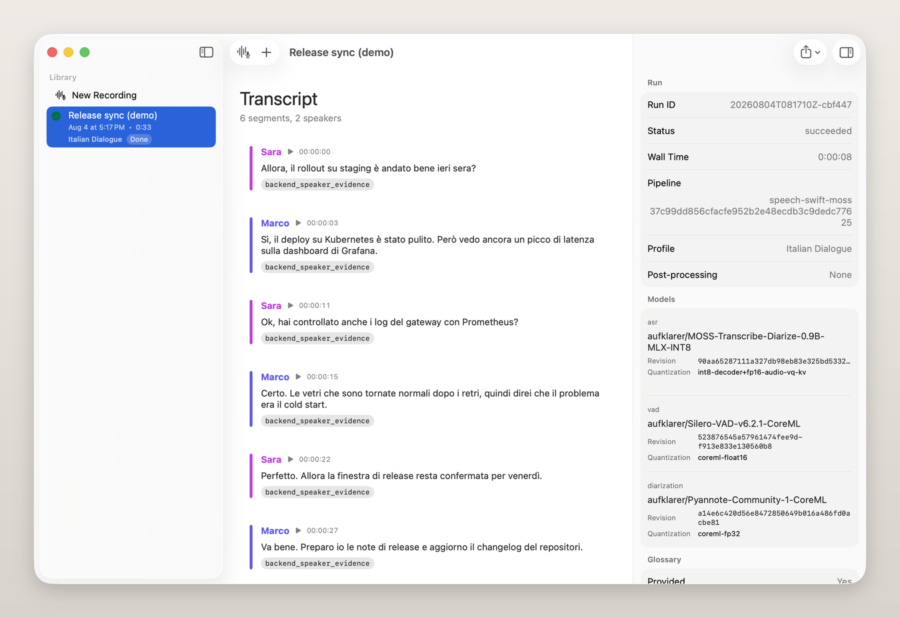
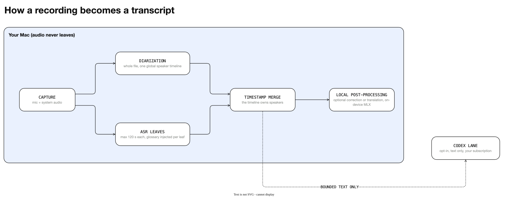
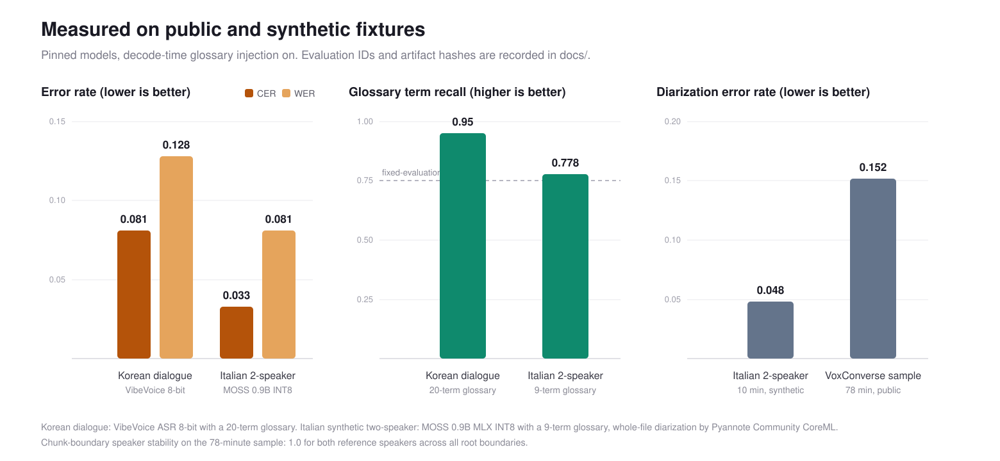
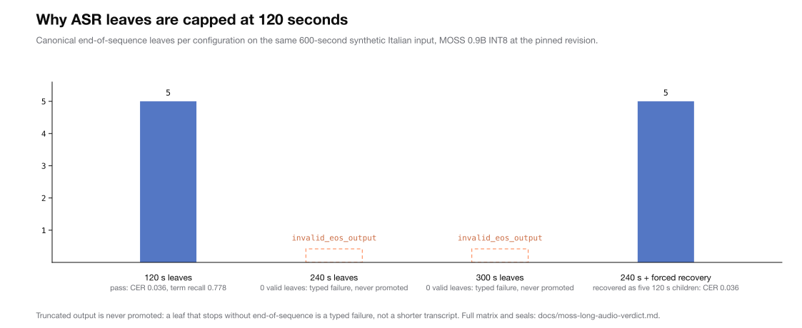
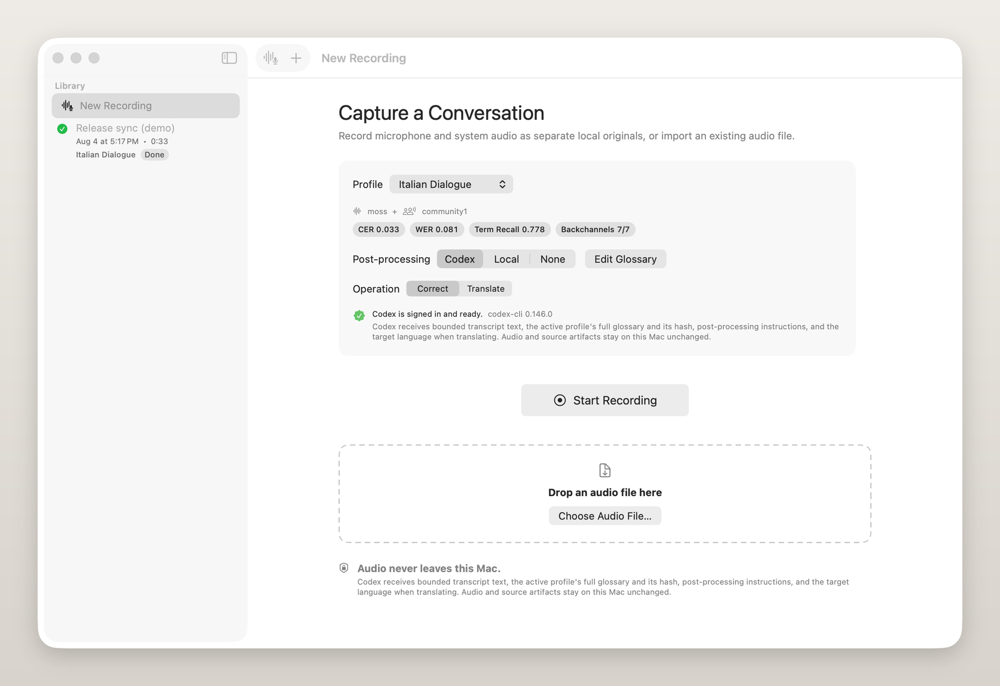

<p align="center">
  
</p>

<h1 align="center">Maccheroni</h1>

<p align="center">
  Локальная транскрибация смешанной речи на Apple Silicon.<br>
  Подстановка глоссария при декодировании · диаризация говорящих по всему файлу · аудио никогда не покидает ваш Mac.
</p>

<p align="center">
  
  
  
</p>

<p align="center">
  <a href="README.md">English</a> · <a href="README.de.md">Deutsch</a> · <a href="README.es.md">Español</a> · <a href="README.fr.md">Français</a> · <a href="README.it.md">Italiano</a> · <a href="README.ja.md">日本語</a> · <a href="README.ko.md">한국어</a> · <a href="README.pt.md">Português</a> · <b>Русский</b> · <a href="README.zh-Hans.md">简体中文</a>
</p>

---

**Maccheroni** (от *macaronic speech*, то есть высказываний со смешением языков) транскрибирует разговоры, с которыми большинство приложений незаметно справляется плохо: корейские совещания с английскими названиями продуктов в каждом предложении, языковые занятия и многоязычные звонки. Всё работает на устройстве с закреплёнными моделями MLX/CoreML.

Так выглядит экспорт (иллюстративный пример, а не вывод модели):

```markdown
**Говорящий 1** [00:04] Smoke tests прошли на staging до того, как мы смержили PR?
**Говорящий 2** [00:09] Да, и rollout в Kubernetes прошёл чисто. [UNCERTAIN] Но на
                       dashboard всё ещё виден скачок задержки, а в логе стоит
                       [CONFLICT: релиз|release].
**Говорящий 1** [00:17] Хорошо, тогда окно выкладки остаётся по плану.
```

Сомнительные исправления помечаются и никогда не подставляются незаметно. Метки говорящих берутся из единственного прохода диаризации по всему файлу, поэтому они остаются согласованными на протяжении двухчасовой записи.

<p align="center">
  
</p>
<p align="center"><em>Каждый запуск сохраняет свои свидетельства: инспектор показывает точные закреплённые модели, статус запуска и то, дошёл ли глоссарий до декодера.</em></p>

## Зачем нужен этот проект

2 августа 2026 года мы проверили на уровне исходного кода семь локальных приложений для транскрибации на macOS. Ни одно не сочетало возможности, необходимые для настоящих совещаний со смешанной речью:

- Приложения с локальной диаризацией не передавали глоссарий модели ASR. Вместо этого они использовали замену строк после распознавания, неработающие параметры SDK или словари только для облачного режима.
- В приложении с лучшим глоссарием на уровне модели не было диаризации.
- «Многоязычная поддержка» почти всегда означает *один язык на сеанс*, хотя смешанная речь устроена иначе.

На уровне библиотек все компоненты уже существуют. На уровне приложений такого сочетания не было. Этот репозиторий реализует его, а результаты проверки находятся в [docs/reference-project-source-audit.md](docs/reference-project-source-audit.md).

## Отличительные особенности

1. **Глоссарий при декодировании.** Имена и технические термины попадают в контекст модели до декодирования, поскольку ошибка ASR уничтожает акустические свидетельства в момент своего появления. Постобработка может отшлифовать текст, но не способна восстановить то, чего декодер никогда не записал. Содержимое глоссария для каждого листа опечатывается хешем в манифесте запуска.
2. **Говорящих определяет один проход диаризации.** Диаризация всего файла выполняется один раз, и только её временная шкала определяет говорящих. ASR обрабатывает ограниченные фрагменты и объединяет их по временным меткам, поэтому локальная догадка о говорящем не может поменять метку на границе фрагментов.
3. **Никакой незаметной потери данных.** Входные данные сверх лимита backend явно завершаются ошибкой или создают план разделения. Усечённый вывод модели считается типизированной ошибкой (`invalid_eos_output`), а не более короткой транскрипцией. Оригиналы и сырые транскрипции неизменяемы; исправления и переводы хранятся как отдельные артефакты, доступные только для создания.

## Как это работает

<picture>
  <source media="(prefers-color-scheme: dark)" srcset="docs/assets/pipeline-dark.drawio.svg">
  
</picture>

Листы с ошибками повторно делятся в типизированных пределах (минимум 30 с, глубина 3), а в каноническую транскрипцию попадает только вывод с маркером конца последовательности. Необязательный путь Codex через вашу подписку ChatGPT/Codex отправляет ограниченные блоки текста транскрипции, активный глоссарий и инструкции, но никогда не отправляет аудио и пути к файлам.

## Модели

Каждая модель закреплена по идентификатору Hugging Face + ревизии + квантованию и записывается в каждый манифест запуска.

| Роль | Модель | Ревизия | Квантование |
|---|---|---|---|
| ASR (итальянский / смешанная речь) | `aufklarer/MOSS-Transcribe-Diarize-0.9B-MLX-INT8` | `90aa6528` | int8-decoder + fp16-audio-vq-kv |
| ASR (корейский) | `mlx-community/VibeVoice-ASR-8bit` | `725c72e5` | int8 |
| VAD | `aufklarer/Silero-VAD-v6.2.1-CoreML` | `52387654` | coreml-float16 |
| Диаризация | `aufklarer/Pyannote-Community-1-CoreML` | `a14e6c42` | coreml-fp32 |
| Постобработка (локальная) | `mlx-community/gemma-4-12B-it-qat-4bit` | `e70c6b3b` | qat-int4 (mlx-vlm 0.6.6) |
| Постобработка (удалённая, только текст) | `gpt-5.6-sol` через сервер приложений Codex | управляется сервисом | не применимо |

## Результаты измерений

Все результаты получены на открытых или синтетических тестовых данных; идентификаторы оценок и хеши артефактов записаны в [docs/](docs/).

<picture>
  <source media="(prefers-color-scheme: dark)" srcset="docs/assets/benchmarks-dark.svg">
  
</picture>

| Тестовые данные | Модель | CER | WER | Полнота терминов | Пропуски | DER |
|---|---|---:|---:|---:|---:|---:|
| Корейский диалог, глоссарий из 20 терминов | VibeVoice | 0.081 | 0.128 | 0.95 | 0 | — |
| Синтетический итальянский диалог с 2 говорящими (10 мин), глоссарий из 9 терминов | MOSS | 0.033 | 0.081 | 0.78 | 0 | 0.048 |
| Фрагмент VoxConverse (78 мин) | VibeVoice + Pyannote | — | — | — | — | 0.152 |

Корейский и итальянский — первые два языковых профиля; новые языковые наборы добавляются в эту таблицу по мере измерений.

Стабильность говорящих на границах фрагментов в 78-минутном примере: 1.0 для обоих эталонных говорящих. Фиксированная матрица длительностью 600 секунд показала, что листы MOSS длиннее 120 с полностью теряют структуру временных меток. Поэтому производственный предел длины листа составляет 120 с; подробности приведены в [docs/moss-long-audio-verdict.md](docs/moss-long-audio-verdict.md).

<picture>
  <source media="(prefers-color-scheme: dark)" srcset="docs/assets/leaf-cap-dark.svg">
  
</picture>

## Установка

Готовых пакетов пока нет, поэтому соберите проект из исходного кода.

Требования: Mac с Apple Silicon, macOS 26, Xcode 26, [uv](https://docs.astral.sh/uv/).

```bash
git clone https://github.com/gigio1023/maccheroni.git
cd maccheroni
swift build && swift test          # 157 tests
zsh scripts/build-app.zsh          # builds and codesigns Maccheroni.app
```

После успешной сборки, инвентаризации разрешённых ресурсов и строгих проверок подписи кода приложение выводит путь к своему bundle. Веса моделей загружаются при первом использовании. Исполняемый файл не содержит веса моделей или среды Python; `maccheroni doctor` проверяет среды выполнения и закреплённые снимки.

Исполняемый файл предоставляет четыре команды продукта:

```bash
.build/debug/maccheroni help [help|run|doctor|capabilities]
.build/debug/maccheroni run recording.wav --profile it-dialogue
.build/debug/maccheroni doctor [--profile NAME] [--profiles PATH] [--json]
.build/debug/maccheroni capabilities [--json]
```

Используйте `maccheroni help`, `maccheroni doctor --json` и `maccheroni capabilities --json` для просмотра справки и получения структурированного вывода. Краткое [руководство по CLI](docs/cli-guide.md) описывает контракты команд и вывода. Транскрибирование и диаризация выполняются на этом Mac, поэтому аудио остаётся локальным.

В комплект входят профили для корейских совещаний (`ko-meeting`, VibeVoice) и итальянских диалогов (`it-dialogue`, MOSS). Для необязательной локальной модели постобработки выполните `zsh scripts/setup-postprocess-runtime.zsh`.

## Конфиденциальность

<p align="center">
  
</p>

- Транскрибация, VAD и диаризация полностью выполняются локально. Аудиобайты никогда не попадают в сеть. Это обеспечивается тестами, а не декларацией.
- Необязательный путь постобработки Codex работает только с текстом и включается отдельно для каждого запуска. Он открывает одноходовый сеанс `codex app-server` с сохранённой авторизацией подписки ChatGPT. Поток временный и доступен только для чтения, инструменты отключены, а запросы подтверждения отклоняются. Prompt содержит текст сегментов, активный глоссарий и инструкции. Этот путь не принимает авторизацию по API-ключу. Если выбрать локальную модель MLX, даже текст останется на устройстве.
- До записи в манифесты запуска сообщения об ошибках ограничиваются по длине, а пути из них удаляются.

## Ограничения

- Только Apple Silicon + macOS 26. Без Intel, iOS, Windows и Linux.
- Только обработка после записи, без субтитров в реальном времени. Это осознанный выбор в пользу качества.
- Качество смешанной речи проверено на тестовых данных, но ещё не подтверждено месяцами настоящих совещаний.
- Для пути Codex нужны собственный вход в Codex CLI и квота вашей подписки.
- По умолчанию интерфейс работает на английском и имеет 10 локализаций; строки ko/it всё ещё помечены для проверки человеком.

## Участие в разработке

Приветствуются сообщения о проблемах и точечные pull request. Команды сборки и тестирования, стандарт проверки утверждений из этого README, правила коммитов и соглашения для issues и PR приведены в [CONTRIBUTING.md](CONTRIBUTING.md).

## Структура репозитория

| Путь | Содержимое |
|---|---|
| `Sources/` | Пакет Swift: Core, Preprocess, ASR, Diarize, Merge, Postprocess, CLI, App |
| `Tests/` | 157 тестов на основе fixtures в 17 наборах |
| `benchmarks/scripts/` | Средства запуска и оценки с производными вердиктами и негативными тестами |
| `docs/` | Обзор исследований, проверки исходного кода, политика ограничений, контракты (схемы JSON), дизайн интерфейса |
| `scripts/` | Сборка bundle приложения, сборка harness MOSS, настройка среды постобработки |
| [PROJECT.md](PROJECT.md) | Иерархия замысла: принципы, нецели, правила принятия решений и журнал решений только для дополнения |
| [AGENTS.md](AGENTS.md) | Рабочие соглашения для этого репозитория |

Каждое утверждение о завершении в документации содержит команду, которая его подтвердила, и наблюдаемый вывод.

## Лицензия и благодарности

MIT. Проект опирается на [speech-swift](https://github.com/soniqo/speech-swift) (среды выполнения речи MLX/CoreML), авторов моделей MOSS, VibeVoice, Silero и pyannote, а также [mlx](https://github.com/ml-explore/mlx). Проверка исходного кода эталонных проектов в `docs/` отмечает 24 проекта с открытым исходным кодом, чьи удачные и неудачные решения повлияли на этот проект.
